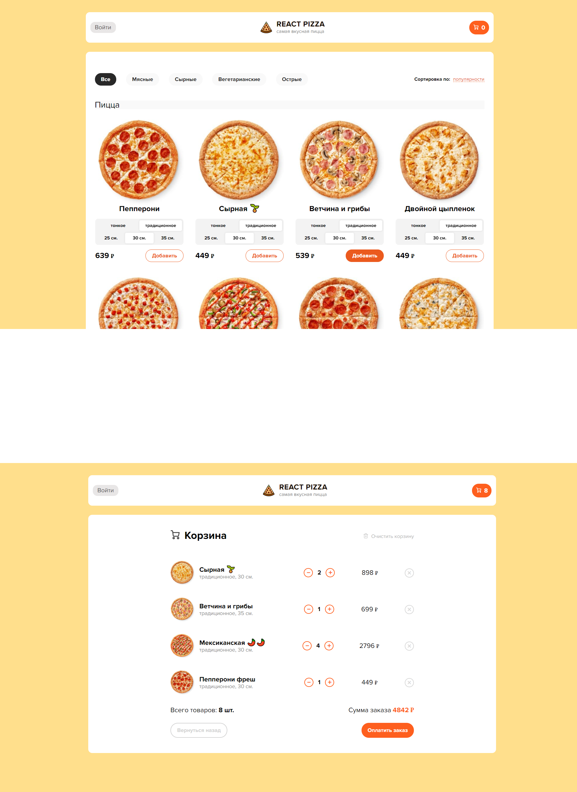

### [Pizza - SPA приложение на React.](https://stalise.github.io/React-Pizza)
Приложение предоставляет функционал пиццерии.
Идея взята у [Archakov](https://github.com/Archakov06). Дизайн немного изменен, а функционал расширен и разработан мной с нуля.
Верстка адаптивно-отзывчивая до 320px.

##### Функционал включает в себя: 
* Регистрация/авторизация пользователя (jwt access + refresh).
* Сортировка товаров.
* Возможность заказа одного товара с разными характеристиками.
* Добавление/удаление товара в корзину.

##### Стек фронтенда:
* HTML
* SCSS(modules)
* TS
* React
* Redux Toolkit
* Jest / React Testing Library
* Eslint, Husky

##### Стек бекенда:
* NodeJs
* ExpressJs
* PostgreSQL
* REST API

##### Обзор:  
